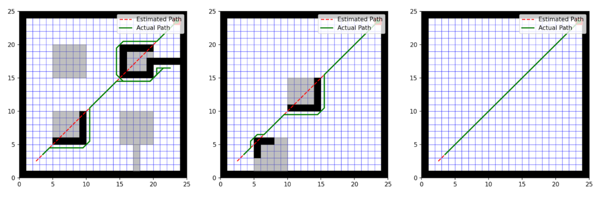

# D* Lite Algorithm Implementation for 2D Grid-Based Path Planning

**Authors:** James Scott & Kenadi Waymire  

---

## Overview
This project focuses on the implementation and simulation of the **D* Lite** algorithm, a dynamic path-planning algorithm, in a 2D grid-based environment. D* Lite is an incremental version of the $A^*$ algorithm designed to efficiently replan paths when obstacles change or are newly discovered during execution. 

This capability is essential for robotics applications where the robot must navigate through unknown or dynamic environments.

---

## Algorithm Details

### Core Logic
The algorithm was implemented from scratch in Python with the following key components:
* **Node Class**: Represents each individual cell in the 25x25 grid.
* **Priority Queue**: Manages nodes based on their priority to determine the most efficient path.
* **D* Lite Class**: Contains the core path-planning and replanning logic.
* **Robot Class**: Simulates movement through the grid and updates position based on the planned path.

### Visualization
The simulation utilizes **Matplotlib** for real-time visualization:
* **Red Path**: Represents the original planned path.
* **Blue Path**: Represents the current planned path after updates.
* **Green Path**: Represents the actual path traveled by the robot.
* **Shapely Polygons**: Used to handle and visualize complex walls and obstacles.

---

## Simulation Environments
The algorithm was evaluated across three distinct configurations to test its adaptability:

1.  **Simple Environment**: A clear grid with no obstacles where the robot follows a straight path.
2.  **Obstacles Environment**: Contains a few scattered obstacles to test basic navigation around dynamic changes.
3.  **Maze Environment**: A complex structure requiring significant navigation and pathfinding capability.

*(Visualization of robot navigating through Maze, Obstacle, and Simple environments)*

---

## Performance Summary

* **Dynamic Replanning**: The algorithm successfully demonstrates the ability to replan paths efficiently as new obstacles are discovered.
* **Limitations**: Current computational complexity can be high in large environments because the planner may recalculate the entire path each time an obstacle is encountered.
* **Grid Constraints**: The current implementation is limited to grid-based environments and would require extension for continuous real-world scenarios.

---

## Future Improvements
Future work aims to optimize the algorithm for larger environments and explore **terrain modifiers**. These modifiers would allow the grid to describe specific cell attributes—such as mud or water—that affect traversal speed and cost.

---
